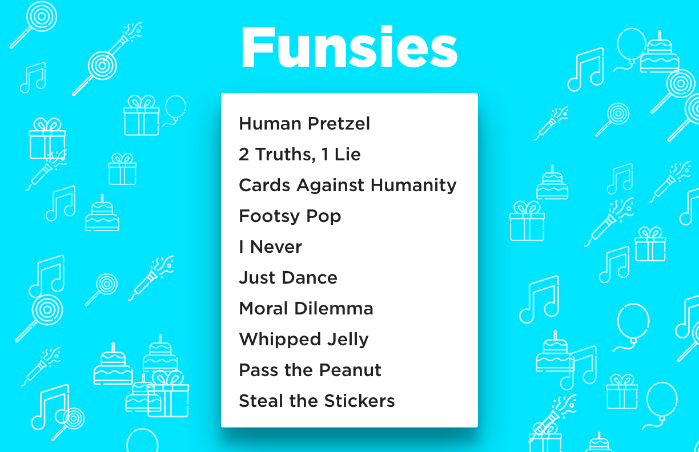

# party-activities

   

Out of ideas for what to do with your friends at the party? Look no further! 🎉

- [View this project on Behance](https://www.behance.net/gallery/53666019/Party-Activities)

## Installation

Open using Sketch 3.

## Usage

Tinkered with the [Confetti Sketch plugin](http://www.sketchconfetti.com/) in order to create these fine looking cards.

Icons are licensed by [Freepik](http://www.flaticon.com/packs/celebrations-3). No copyright intended.

## Contributing

> To get started...

- 🍴 Fork this repo [here](https://github.com/fvcproductions/party-activities#fork-destination-box)
- 🔨 Hack away
- 👥 Add yourself as a contributor under credits
- 🔧 Make a pull request [here](https://github.com/fvcproductions/party-activities/compare)
- 🎉 Get your pull request approved - success!

Or just [create an issue](https://github.com/fvcproductions/party-activities/issues) - any little bit of help counts! 😊

## Credits

- [FVCproductions](http://fvcproductions.com) 🍓🍫
